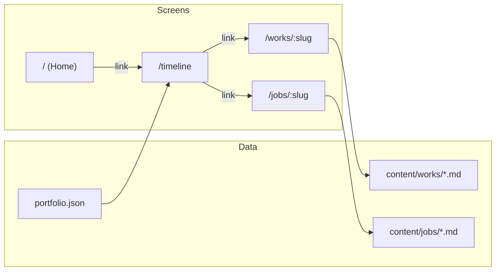

# Portfolio site plan (Nuxt 4 + Tailwind)

## Stack

- **Nuxt 4** – app framework and routing  
- **Tailwind CSS** – styling  
- **@nuxt/content** – render MD files for Screen 3  
- **TypeScript** – types for portfolio JSON and components  
- **Vue 3** – composition API (default in Nuxt 4)

No Pinia; timeline scroll position is persisted with **sessionStorage** when navigating back from a content page. No extra UI library; the timeline is custom with Tailwind.

---

## Data model

Portfolio data comes from a JSON file **fetched at runtime** from `public/portfolio.json` (served as `/portfolio.json`). Typed in TypeScript (`types/portfolio.ts`). Fetching (instead of static import) keeps the JSON out of the JS bundle, allows a loading state, and lets you update the file without rebuilding. **Prefetch:** trigger the fetch on screen 1 (e.g. in layout or home) using Nuxt's `useFetch` with a stable key so the timeline gets cached data when the user navigates. Optional: after the JSON loads, prefetch the first N work/job MD documents for faster detail opening.

**Works** (top row on timeline):

- `slug` – used for route `/works/[slug]` and to resolve `content/works/[slug].md`
- `title` – optional label (e.g. for tooltip or aria)
- `dateRange` – `{ start: string, end: string }` (e.g. `"2024"`, `"2025"`)
- `imageUrl` – URL for the circle thumbnail (relative to `public/` or absolute)

**Jobs** (bottom row):

- `slug` – used for route `/jobs/[slug]` and to resolve `content/jobs/[slug].md`
- `title` – optional label
- `dateRange` – `{ start: string, end: string }`
- `color` – optional (e.g. `#hex` or Tailwind class name) for the rectangle

Example:

```json
{
  "works": [
    { "slug": "project-alpha", "title": "Project Alpha", "dateRange": { "start": "2025", "end": "2026" }, "imageUrl": "/images/works/alpha.jpg" }
  ],
  "jobs": [
    { "slug": "acme-corp", "title": "Acme Corp", "dateRange": { "start": "2024", "end": "2025" }, "color": "#3B82F6" }
  ]
}
```

You'll add corresponding MD files: `content/works/project-alpha.md` and `content/jobs/acme-corp.md`.

---

## Screen structure and routing


| Screen       | Route(s)                                | Purpose                                                                                          |
| ------------ | --------------------------------------- | ------------------------------------------------------------------------------------------------ |
| 1 – Home     | `/`                                     | Centered link to timeline (you implement the rest)                                               |
| 2 – Timeline | `/timeline` (or `/works` – your choice) | Two horizontal rows: works (circles + images), jobs (colored rectangles); free horizontal scroll |
| 3 – Detail   | `/works/[slug]`, `/jobs/[slug]`         | Renders one MD file from Nuxt Content                                                            |


Screen 3 uses Nuxt Content's `queryCollection` or dynamic `queryContent` by path (e.g. `content/works/${slug}.md` and `content/jobs/${slug}.md`). If a slug is missing from content, show a 404 or a "coming soon" message.

---

## High-level architecture




---

## Implementation outline

### 1. Project setup

- Init Nuxt 4 project (or migrate if you have one).
- Add Tailwind (e.g. `@nuxtjs/tailwindcss`), `@nuxt/content`, TypeScript.
- Optional: ESLint/Prettier.

### 2. Portfolio data and types

- **JSON:** Place `portfolio.json` in `public/` so it is served at `/portfolio.json` (or keep `data/portfolio.json` as the source and copy it to `public/` in build if you prefer). Structure: `{ works: Work[], jobs: Job[] }` as above.
- **Types:** Define interfaces in `types/portfolio.ts` (e.g. `DateRange`, `Work`, `Job`, `Portfolio`).
- **Composable:** `composables/usePortfolio.ts` fetches the JSON (e.g. via `useFetch('/portfolio.json', { key: 'portfolio' })`), computes **year range** (`minYear` = min of all `dateRange.start`/`end` in data, `maxYear` = current year), and returns typed `works`, `jobs`, `minYear`, `maxYear`, plus `pending` and `error` for loading/error UI.
- **Prefetch on screen 1:** Trigger the same fetch when the app or home screen loads (e.g. in default layout or `app.vue` or home page) so that by the time the user clicks to the timeline, data is cached. Use the same `useFetch` key on the timeline page to read from cache. Optional: after JSON loads, prefetch the first N content docs (by slug) for faster detail page loads.

### 3. Screen 1 – Home

- Single page at `/` with a centered link to `/timeline` (or chosen timeline route). No other structure required from the plan; you own the rest of the design. This screen is the right place to **trigger portfolio prefetch** (e.g. call or mount something that runs `useFetch('/portfolio.json', { key: 'portfolio' })`) so the timeline loads instantly when the user navigates.

### 4. Screen 2 – Timeline

- **Layout**: Two horizontal scroll areas (or one scroll container with two rows):
  - **Top row**: works – circles with images, positioned by date range.
  - **Bottom row**: jobs – colored rectangles, positioned by date range.
- **Axis**: Reuse your sketch idea: a horizontal axis with year markers; position items by mapping `dateRange.start`/`end` to pixel or % positions. **Year range is computed, not fixed**: `minYear` = earliest year among all works' and jobs' `dateRange.start`; `maxYear` = current year (e.g. `new Date().getFullYear()`). The timeline always runs from "now" back to the oldest item in the data, so it stays correct in 2026, 2027, etc. without code changes.
- **Scroll**: One shared horizontal scroll (free scroll, no snap). Use a single scrollable wrapper and overflow-x-auto; both rows share the same scroll so they stay in sync.
- **Scroll position**: Persist horizontal scroll position in **sessionStorage** (e.g. key `timelineScrollLeft`). On mount, read and restore `scrollLeft`; on scroll or in `onBeforeUnmount`, write current `scrollLeft`. When the user returns from a work/job detail page, the timeline opens at the same position (and survives tab refresh within the session).
- **Links**: Each circle → `NuxtLink` to `/works/[slug]`; each rectangle → `NuxtLink` to `/jobs/[slug]`.
- **Images**: Use the `imageUrl` from JSON (e.g. `` or Nuxt's image module if you add it later).

Implementation detail: compute `minYear` and `maxYear` in a composable from the portfolio data + current year; then either (a) `yearToPosition(year, minYear, maxYear, width)` in JS, or (b) set CSS vars `--year-min`, `--year-max` (and optionally `--current-year`) and use `left: calc(...)` so the scale is responsive. Year markers on the axis are generated for each year in `[minYear .. maxYear]` (or a subset if the range is large).

### 5. Screen 3 – Work and job detail

- **Routes**: Two dynamic routes: `pages/works/[slug].vue` and `pages/jobs/[slug].vue` (or one `pages/[type]/[slug].vue` with `type` in `['works','jobs']` – your choice; separate routes match your "separate" preference).
- **Content**: Use Nuxt Content to render the MD file:
  - Path convention: `content/works/` and `content/jobs/` with files named `[slug].md`.
  - In the page, call `queryContent(`/works/${slug}`)` (or equivalent) and render with `<ContentRenderer>`.
- **Navigation**: Add a "Back to timeline" (or "Back") link to `/timeline`.
- **404**: If `queryContent` returns nothing, show a 404 or a fallback message.

### 6. Optional enhancements (not required for MVP)

- **Nuxt Image**: Add later to optimize circle thumbnails (sizes, lazy load).
- **Meta**: Use `useHead` or Nuxt's built-in meta in each Screen 3 page to set title/description from MD frontmatter (e.g. `title`, `description` in the MD file).

---

## Suggested file structure

```
├── app/
│   └── app.vue
├── nuxt.config.ts
├── public/
│   └── portfolio.json    # fetched at runtime; optional: keep data/portfolio.json as source and copy to public in build
├── data/
│   └── portfolio.json    # optional source copy (if not editing public/ directly)
├── types/
│   └── portfolio.ts      # DateRange, Work, Job, Portfolio
├── content/
│   ├── works/
│   │   └── [slug].md
│   └── jobs/
│       └── [slug].md
├── pages/
│   ├── index.vue          # Screen 1 – home; trigger portfolio prefetch, link to timeline
│   ├── timeline.vue        # Screen 2 – two-row timeline (usePortfolio uses cached fetch)
│   ├── works/
│   │   └── [slug].vue      # Screen 3 – work detail
│   └── jobs/
│       └── [slug].vue      # Screen 3 – job detail
├── components/
│   ├── TimelineRow.vue    # one row: works or jobs
│   ├── WorkMarker.vue     # circle + image + link
│   ├── JobMarker.vue      # rectangle + link
│   └── (optional) YearAxis.vue
└── composables/
    └── usePortfolio.ts    # fetch /portfolio.json (useFetch key), return { works, jobs, minYear, maxYear, pending, error }
```

---

## What you'll do yourself

- Screen 1: Full home page design; we only ensure a centered link to the timeline.
- Content: Writing and maintaining all `content/works/*.md` and `content/jobs/*.md` and keeping `public/portfolio.json` (or `data/portfolio.json`) in sync (slugs, dates, imageUrl, color).
- Assets: Adding images referenced by `imageUrl` (e.g. under `public/images/works/`).

---

## Summary

- **Stack**: Nuxt 4, Tailwind, @nuxt/content, TypeScript. Timeline scroll position via sessionStorage (no Pinia).
- **Data**: Portfolio JSON fetched at runtime from `public/portfolio.json`; prefetch on screen 1 (useFetch with stable key); types in `types/portfolio.ts`; `usePortfolio()` returns works, jobs, minYear, maxYear, pending, error. Optional: prefetch first N content docs after JSON loads.
- **Screens**: (1) Home with link to timeline; (2) Two-row horizontal timeline (works row + jobs row), free scroll, circles with images and colored rectangles as links; (3) `/works/[slug]` and `/jobs/[slug]` rendering the corresponding MD file via Nuxt Content.
- **Routing**: Separate routes for works and jobs as requested; MD files live in `content/works/` and `content/jobs/` and are resolved by slug.

If you want, next step can be a concrete `portfolio.json` example and the exact `queryContent` call for Screen 3 in your repo layout.
